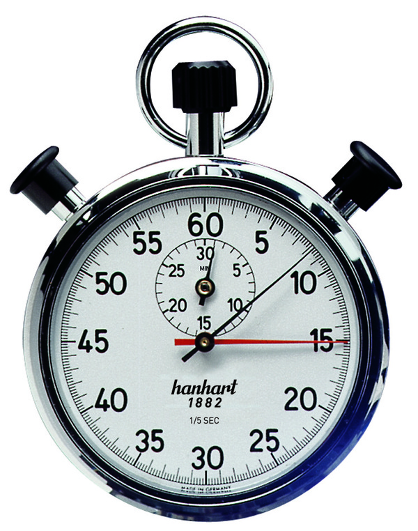

# stopwatch_exercise

This is an execrise to understand asyncronous programing, as it happens in the Javascript Environment.

## Why 
Modern features of the language, like the Async/Away pattern, make the code look like belonging to the Imperative paradigm.
That is when one line of code is executed after the other, with comands being blocking.
This has undeniable advantages in terms of readability.

However Javascript and in particular Node.js are well known for their async non-blocking behaviour. It is beneficial to 
understand this behaviour, in order to use Async/Await and promises correctly.

## What
For this exercise you will build a simple stop watch. The stop watch must include the following feature:

* The app will be a single javascript object.
* it will include the `start()`, `stop()`, `lap()` and `reset()` methods. 
* It will be written in vanilla Javascript.
* it will include a simple GUI written in plain javascript/css ( maibe use bootstrap or similar ? ).
* the first iteration of this app should not use promises nor the async/away syntax, but rather simple (callbacks)(https://codeburst.io/javascript-what-the-heck-is-a-callback-aba4da2deced).

* if you proceed to a second iteration, this should use promises. 

### Stretch Goal
* Write a third iteration using Async/Away. 
* Error handling. Error handlilng changes drasticallly depending if your code uses callbacks, promises of async/await.
Try to handle error accordingly to how you are writing your code. 
